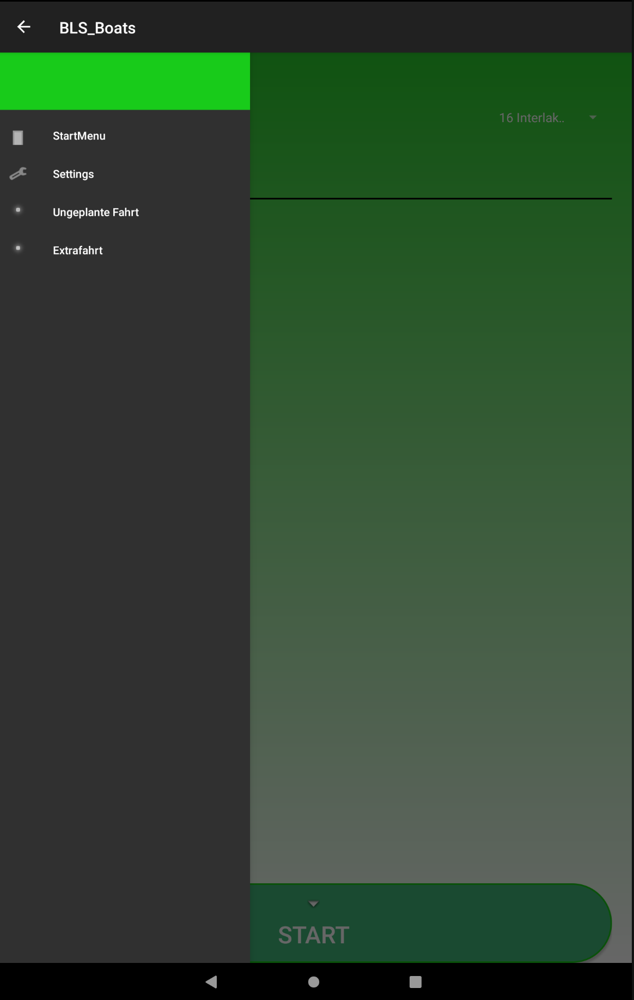
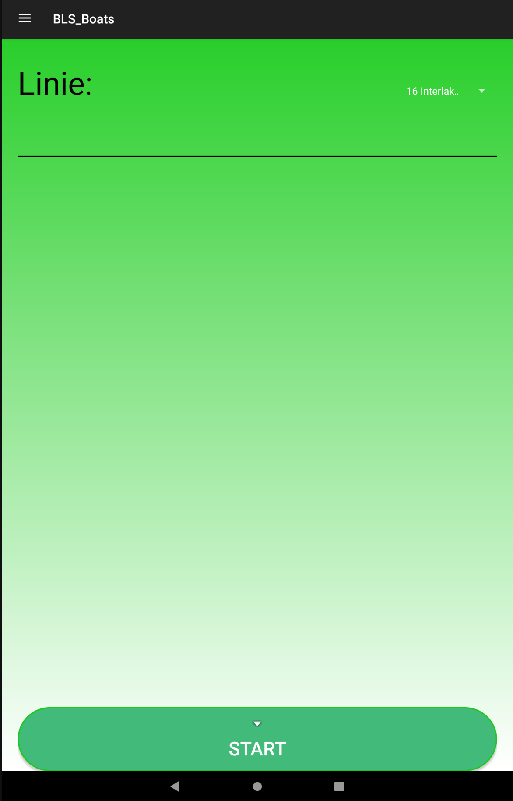
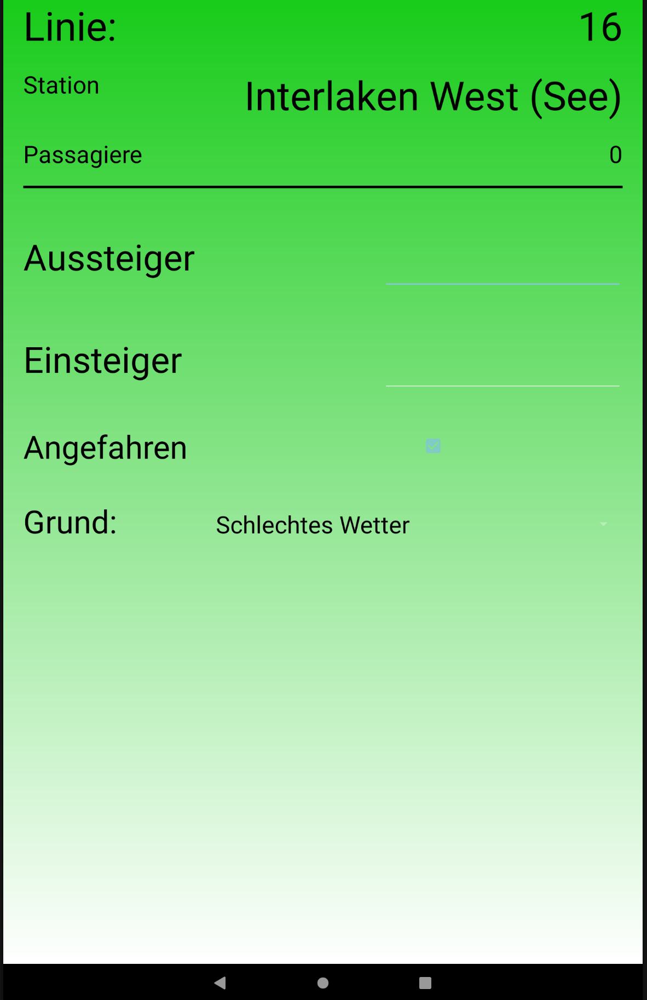
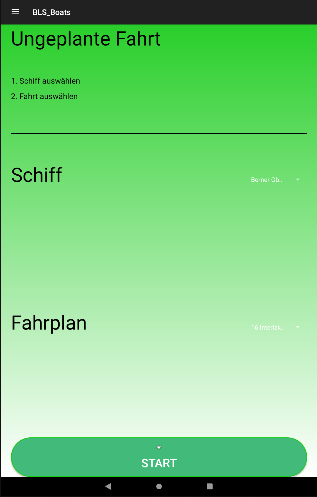
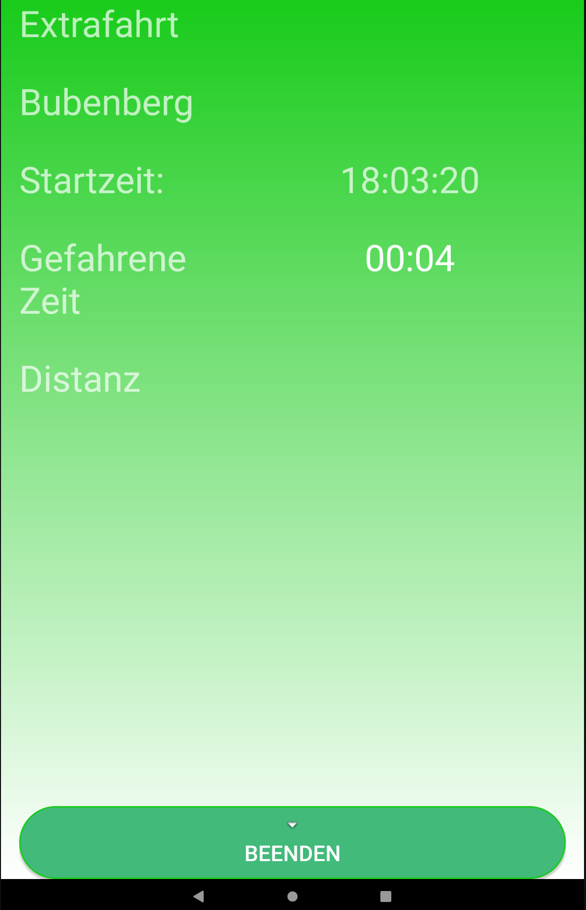

# BLS_Passengerdata

## Android Application for raising frequency records on ships of the BLS(BLS AG is a Swiss railway company)

### This app was developed by Silas Stulz and Yannick Stebler in terms of the module "Projekt 1" at the University of Applied Sciences Bern

## Usage
There are no special requirements for using this application. Just pull the repository and open it on your preferred IDE or build the APK to export it to a mobile phone.

## Functionality
This app was developed specifically for the BLS and their need for a prototype to raise frequency records on ships. You can find more information about the requirement engineering we've done in the documentation (although it is in german).
<b> You can find it here:
[Documentation](https://github.com/Hyferion/BLS_Passengerdata/blob/master/Documentation/anforderungsspezifikation.pdf)
</b>
 
 
There are 3 types of trips possible in the application and accessible through the menu.

### 1.Normalfahrt
This is just a normal trip on the assigned line with the boat specified in the settings. There is a screen for every stop, where you can insert the people currently on board and extra information if it's not possible to reach that stop for a reason.

 

At the end is the overview where you see the information for the whole trip, and you are able to send this information to the backend. Or you can always go back and edit the information.

### 2.Spezialfahrt/Ungeplante Fahrt
The same as a "Normalfahrt" but it's not scheduled in the timetable. This is a additional trip if there are lots of people for example.

The only difference is that it will be recorded differently in the backend.

### 3.Extrafahrt
This is a special trip that does not have any planed stops. This could be a cruise where you can eat on the ship. The BLS gets payed for the distance travelled and the time on board. Currently the time gets recorded and from that we calculate the distance travelled and gas used. 

### Settings
In the settings you have the following options:

- GET: Endpoint from where to get the timetable information
- POST: Endpoint to post the completed trips
- Bearer: Token for authentication
- Schiff: The Ship this device is assigned to
- Delete after: The days after a completed trip gets deleted from the device
